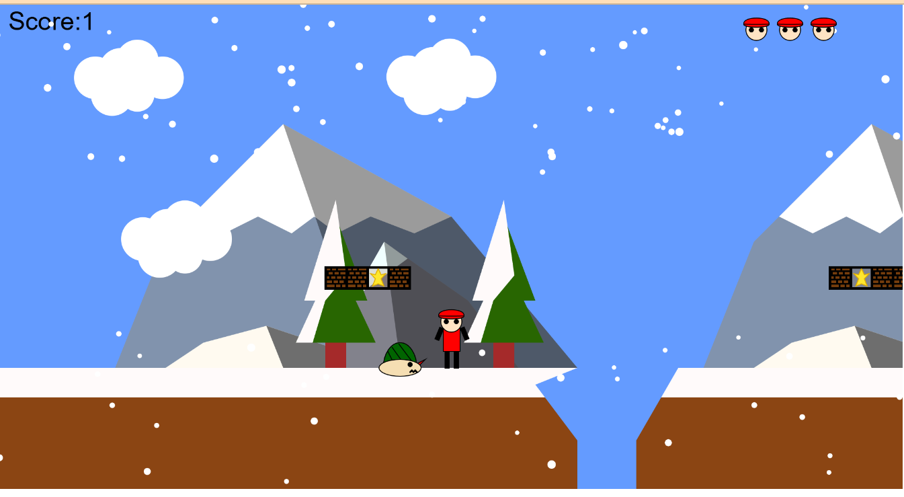

# 2D-Game by P5.js
A 2D platformer game inspired by Mario, built using p5.js. Jump, run, and dodge obstacles to reach the goal!

## Features 
- Classic 2D platformer mechanics (jumping, running)
- Enemies and obstacles
- **Breakable mystery boxes** - Jump to hit them and reveal a star for points!
- Background music and sound effects

## Challenge and Learning
Developing this game introduced several challenges, particularly in handling multiple enemies, implementing platform logic, and organizing the code effectively. Initially, enemy behavior was uniform due to my coding approach, causing unintended interactions upon elimination. To resolve this, I used Boolean values to track individual enemy states, allowing independent actions.

This project also helped me improve my code structuring skills, making the game logic more adaptable and scalable. By refining the platform logic, I gained precise control over star-containing blocks and character interactions. Additionally, using constructor functions improved code organization, making it easier to manage multiple entities efficiently.

Overall, this experience strengthened my ability to write well-structured code and implement complex mechanics, preparing me for future development projects.

## Screenshot

##  Installation & Running the Game
- Git clone the repository https://github.com/kxboon/2D-Game
- Open `index.html` in a browser or use a local server.

## Technologies Used
- Javascript
- p5.js (Coding library)
- HTML
- CSS
- GitHub

## Skills
- Game Mechanics & Logic
- Code Organization & Optimization
- UI/UX Design & Player Experience

## License
All sound effects are from https://freesound.org/

Feel free to reach me at boonkx755@gmail.com !